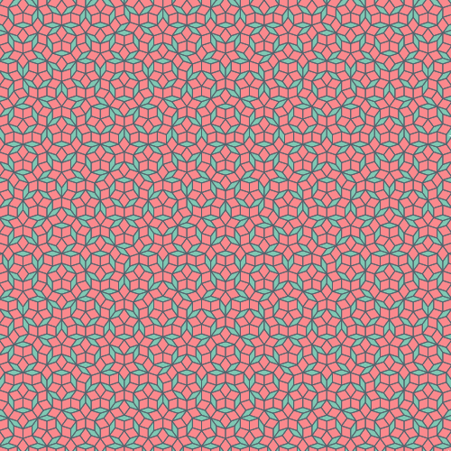

# Penrose-JS

A JavaScript library for generating beautiful [Penrose](https://en.wikipedia.org/wiki/Penrose_tiling) tilings - non-periodic tilings named after mathematician [Roger Penrose](https://en.wikipedia.org/wiki/Roger_Penrose).

_Built for learning, exploring and imagining._



## Features

- Generate Penrose tilings with customizable options
- Two rendering methods:
  - Canvas-based rendering for web applications
  - Bitmap/pixel-based rendering for more control and potential use in non-canvas environments
- Easy to use API with sensible defaults
- Supports various customization options (colors, dimensions, subdivision levels)

## Installation

```bash
npm install penrose-js
```

## Usage

### Canvas Rendering

```javascript
import { PenroseCanvas } from 'penrose-js';

// Get canvas and context
const canvas = document.getElementById('myCanvas');
const ctx = canvas.getContext('2d');

// Create a Penrose tiling generator
const penrose = new PenroseCanvas();

// Generate the tiling with options
penrose.generatePenroseTiling({
  ctx: ctx,
  width: 800,
  height: 800,
  divisions: 5,
  zoomType: 'in',
  color1: '#cc4c4c',  // color for thin rhombi
  color2: '#4c99cc',  // color for thick rhombi
  color3: '#333333'   // color for outlines
});
```

### Bitmap Rendering

```javascript
import { PenroseBitmap } from 'penrose-js';

// Create a Penrose bitmap generator
const penrose = new PenroseBitmap();

// Generate pixel data
const pixelData = penrose.generatePenroseTiling({
  width: 800,
  height: 800,
  divisions: 5,
  zoomType: 'in',
  color1: [1, 0, 0, 1],  // RGBA for thin rhombi (normalized 0-1)
  color2: [0, 0, 1, 1],  // RGBA for thick rhombi (normalized 0-1)
  color3: [0, 0, 0, 1],  // RGBA for outlines
  backgroundColor: [1, 1, 1, 1]  // RGBA background color
});

// Use with canvas
const canvas = document.getElementById('myCanvas');
const ctx = canvas.getContext('2d');
const imageData = new ImageData(pixelData, 800, 800);
ctx.putImageData(imageData, 0, 0);
```

### Using in Browser (via CDN)

```html
<!-- UMD Version (unminified) -->
<script src="https://unpkg.com/penrose-js@0.1.0/dist/penrose-js.umd.js"></script>

<!-- UMD Version (minified) -->
<script src="https://unpkg.com/penrose-js@0.1.0/dist/penrose-js.umd.min.js"></script>

<script>
  // Access via global variable
  const penrose = new penrosejs.PenroseCanvas();
  // ... use as normal
</script>
```

## API Reference

### Class: `Penrose`

Abstract base class that provides common functionality.

#### Constructor

```javascript
const penrose = new Penrose(defaultOptions);
```

- `defaultOptions` (optional): Custom default options to override built-in defaults

#### Methods

- `generatePenroseTiling(options)`: Abstract method implemented by subclasses

### Class: `PenroseCanvas` (extends `Penrose`)

Class for generating tilings directly on a canvas.

#### Methods

- `generatePenroseTiling(options)`: Generates a Penrose tiling on a canvas
  - Returns the canvas context for chaining

#### Options

- `ctx` (required): Canvas 2D context to draw on
- `divisions` (default: 5): Number of subdivision iterations
- `zoomType` (default: 'in'): Zoom level ('in' or 'out')
- `width` (default: 800): Width of the output
- `height` (default: 800): Height of the output
- `color1`: Color for thin rhombi (CSS color string or RGBA array)
- `color2`: Color for thick rhombi (CSS color string or RGBA array)
- `color3`: Color for outlines (CSS color string or RGBA array)
- `backgroundColor`: Background color (CSS color string or RGBA array)

### Class: `PenroseBitmap` (extends `Penrose`)

Class for generating tilings as pixel data.

#### Methods

- `generatePenroseTiling(options)`: Generates a Penrose tiling as pixel data
  - Returns a `Uint8ClampedArray` containing RGBA pixel data

#### Options

- `divisions` (default: 5): Number of subdivision iterations
- `zoomType` (default: 'in'): Zoom level ('in' or 'out')
- `width` (default: 800): Width of the output
- `height` (default: 800): Height of the output
- `color1`: Color for thin rhombi (CSS color string or RGBA array)
- `color2`: Color for thick rhombi (CSS color string or RGBA array)
- `color3`: Color for outlines (CSS color string or RGBA array)
- `backgroundColor`: Background color (CSS color string or RGBA array)

## Development

### Running the Development Server

```bash
# Install dependencies
npm install

# Start the development server
npm run dev
```

This will start a development server and open a browser to a demo page showcasing both the Canvas and Bitmap renderers.

### Building the Library

```bash
# Build for production (standard and minified versions)
npm run build

# Build for debugging (unminified with source maps)
npm run build:debug
```

The build output includes:

- ES modules:
  - Standard: `dist/penrose-js.es.js`
  - Minified: `dist/penrose-js.es.min.js`
  
- UMD modules:
  - Standard: `dist/penrose-js.umd.js`
  - Minified: `dist/penrose-js.umd.min.js`
  
- Debug build: `dist/penrose-js.debug.js`
- TypeScript declaration files: `dist/index.d.ts`

## Implementation Details

Penrose tilings are fascinating mathematical structures that fill a plane non-periodically with a small set of shapes. This library implements the P3 Penrose tiling system (rhombus-based).

The generation algorithm:

1. Starts with a set of triangles arranged in a decagon
2. Iteratively subdivides these triangles using specific rules based on the golden ratio
3. After the specified number of subdivision iterations, constructs the final tiling

Two rendering approaches are provided:

- **Canvas-based**: Uses the HTML5 Canvas API's path drawing
- **Bitmap-based**: Uses direct pixel manipulation for environments without Canvas

The mathematical foundation relies on:

- Complex number operations for precise vertex calculations
- The golden ratio (φ ≈ 1.618) as a key component of subdivision rules
- Triangle-based subdivision that produces the distinctive Penrose pattern

## Examples

See the `demos` directory for examples:

- `canvas-example.html`: Shows the canvas-based rendering approach
- `bitmap-example.html`: Shows the bitmap-based rendering approach

## License

MIT
